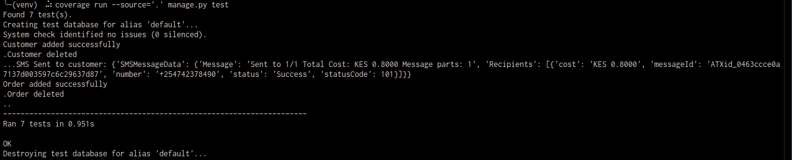
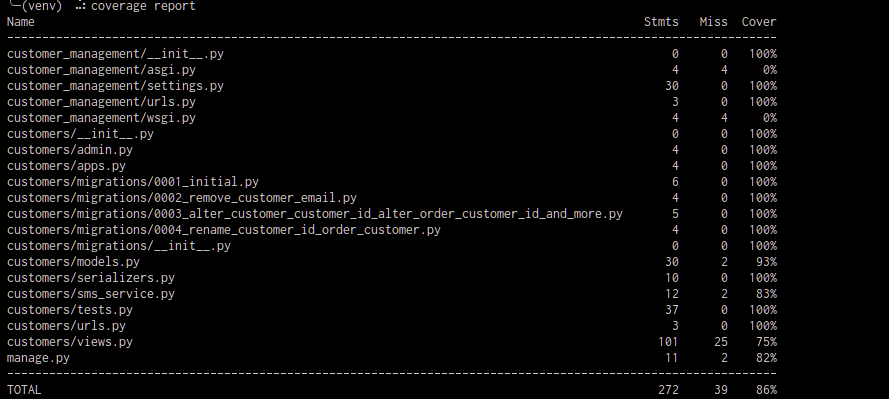
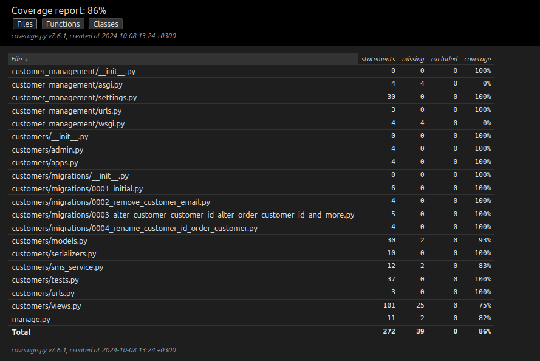
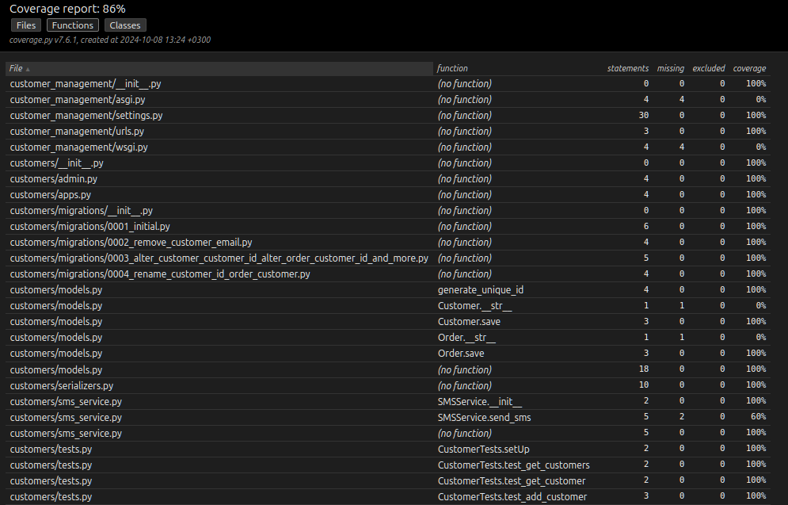
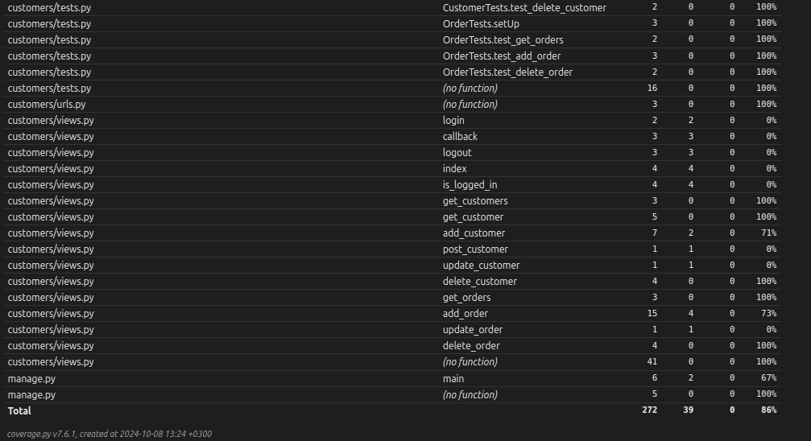
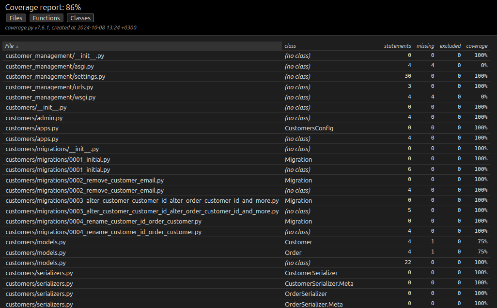
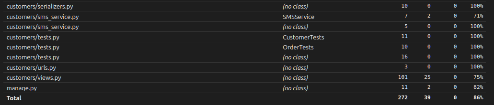

# Customers and Orders
- 
## Frontend
- 
## Backend
- 
## Unit Testing and Coverage checking
- Unit testing is done using Django's inbuilt TestCase library together with **pytest**.
- Simple test cases are written for the Customer and Order APIs and run using **coverage**.
    - *coverage run --source='/customers' manage.py test*
- The coverage report is generated using **coverage** library
    - *coverage report*
        
        
    - *coverage html*
        Files: 
        Functions: 
        Classes:  
## CI + Automated CD 