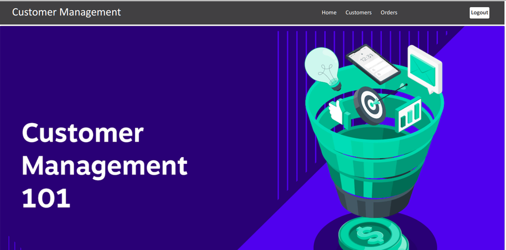
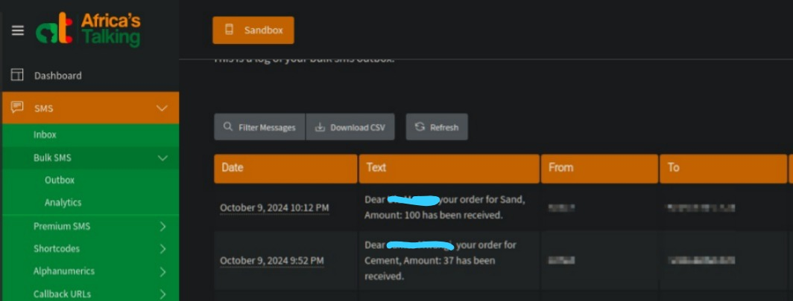
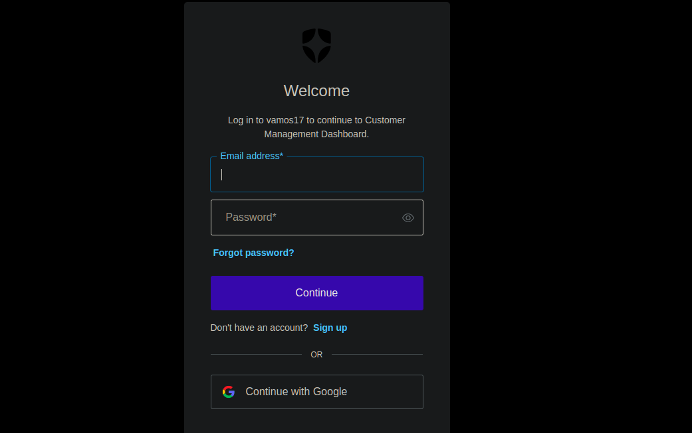

# Customer Management
- This is a simple application consisting of a Django web REST service and a React frontend
- The application provides a simple dashboard for adding customers and orders. A customer has:
    - a name
    - a phone number
    and an order has:
    - item
    - amount
    - time added
- The order is matched to a specific user, and an SMS is sent to the user's phone number when a matching order has been added.
- The application can be accessed here: https://customer-management-client.onrender.com/

## Frontend
- The frontend has been built using **ReactJS** using **Vite** and **pnpm** as the node package manager.
- To run the application locally follow the following steps:
    1. Clone the repository - [customer-management](https://github.com/JJFelix/customer-management.git) by running *git clone https://github.com/JJFelix/customer-management.git*
    2. Run *cd customer_management_frontend* to switch to the frontend directory
    3. Run *pnpm install* (Ensure **pnpm** is installed in your local environment) - [Click here](https://pnpm.io/installation) to learn about installing pnpm
    4. Run *pnpm run dev* to start the **Vite** development server
    5. You should see the following page:
    

## Backend
- The backend is a django REST api that provides the logic for the various actions.
- The api provides the following endpoints:
1. /api/ 
- This is the index endpoint
2. /api/login
- The endpoint for login functionality
3. /api/logout
- The endpoint for logout functionality
4. /api/callback
- This is the endpoint to which the OAuth2 authentication flow will redirect after the user has been logged in
5. /api/is_logged_in
- The endpoint to check whether a user is in session or not
6. /api/test
- A test endpoint to quickly confirm that the API is working well
7. /api/customers
- A GET endpoint to return all customers
8. /api/customers/<str:customer_id>
- - A GET endpoint to return a single customer
9. /api/customers/add
- A POST endpoint to add a customer
10. /api/customers/delete
- A DELETE endpoint to delete a customer
11. /api/orders
- A GET endpoint to return all orders
12. /api/orders/add
- A POST endpoint to add an order
13. /api/orders/delete
- A DELETE endpoint to delete an order
14. https://customer-management-api-grx3.onrender.com/api/test?format=json
- This is the production test endpoint to test that the deployed api is functional

### SMS Sending
- The Africastalking SMS gateway sandbox was used to add the SMS sending functionality when an order has been added matching an existing user

### Authentication
- Authentication was performed using **OpenID Connect** that sits on top of **OAuth 2.0** to provide authentication functionalities to applications and also provide additional information such as the user's profile info.

## Unit Testing and Coverage checking
- Unit testing is done using Django's inbuilt TestCase library together with **pytest**.
- Simple test cases are written for the Customer and Order APIs and run using **coverage**.
    - *coverage run --source='/customers' manage.py test*
- The coverage report is generated using **coverage** library
    - *coverage report*
        
        
    - *coverage html*
        - Files: 
        - Functions: 
        - Classes:  

## CI + Automated CD 
- Continuous Integration has been done using Github actions to automatically run tests and generate coverage reports on every push or pull request.
- Defined in the *.github/workflows/ci_cd.yml* file

- Continuous Deployment has been done to **Render**, a freemium hosting **PaaS - Platform as a Service**. The application is automatically deployed to Render on push or pull request to the connected Github repository. 
- The entire CI//CD pipeline has been defined in the *.github/workflows/ci_cd.yml* file